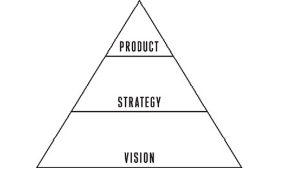

The Lean Startup uses validated learning as a unit of progress.

Unfortunately, too many startup business plans look more like
they are planning to launch a rocket ship than drive a car.

Startups also have a true north, a destination in mind: creating a
thriving and world-changing business. I call that a startup’s vision.
To achieve that vision, startups employ a strategy, which includes a
business model, a product road map, a point of view about partners
and competitors, and ideas about who the customer will be. The
product is the end result of this strategy

Products change constantly through the process of optimization,
what I call tuning the engine. Less frequently, the strategy may have
to change (called a pivot). However, the overarching vision rarely
changes. Entrepreneurs are committed to seeing the startup through
to that destination. Every setback is an opportunity for learning
how to get where they want to go

